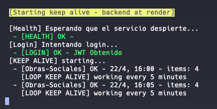

# Keep Server Alive (Render Free Tier)

Script en **Node.js + TypeScript** diseñado para evitar que un backend alojado en Render (plan gratuito) entre en estado de inactividad (_sleep_).

## 📌 Problema

Los servicios en Render Free se suspenden después de algunos minutos sin tráfico.

Cuando esto ocurre:

- El primer request puede tardar varios minutos (cold start)
- La experiencia de usuario se degrada
- Puede generar timeouts en clientes

---

## ⚙️ ¿Qué hace este script?

### 1. Health Check

Hace requests a:

```
/api/v1/health
```

Hasta que el servicio responde correctamente.

### 2. Autenticación

Realiza login contra:

```
/api/v1/auth/login
```

Obtiene un JWT y lo mantiene en memoria.

### 3. Keep Alive

Consume periódicamente:

```
/api/v1/obras-sociales
```

Enviando el token como Bearer.

Si el token expira → vuelve a loguear automáticamente.

### 4. Loop continuo

Ejecuta requests cada pocos minutos para evitar que Render suspenda el servicio.

---

## 🚀 Cómo usarlo

### Instalar dependencias

```
npm install
```

### Desarrollo (watch)

```
npm run dev
```

### Producción

```
npm run build
npm start
```





---

## 🔧 Configuración

Podés ajustar el intervalo:

```
const KEEP_ALIVE_INTERVAL = 4 * 60 * 1000;
```

Se recomienda mantenerlo por debajo de 5 minutos.

---

## ⚠️ Problemas conocidos

### Límite de conexiones en la base de datos (Filess)

Puede aparecer:

- too many connections
- errores intermitentes en endpoints

### Solución

1. Ir a: https://panel.filess.io
2. Seleccionar la base de datos
3. Eliminar conexiones activas
4. Reintentar

---

## 🧠 Consideraciones

- Pensado para desarrollo o demos
- No reemplaza infraestructura productiva
- Puede estar limitado por políticas de Render

---

## 📦 Requisitos

- Node.js 18+
- TypeScript

---

## 📄 Licencia

MIT
