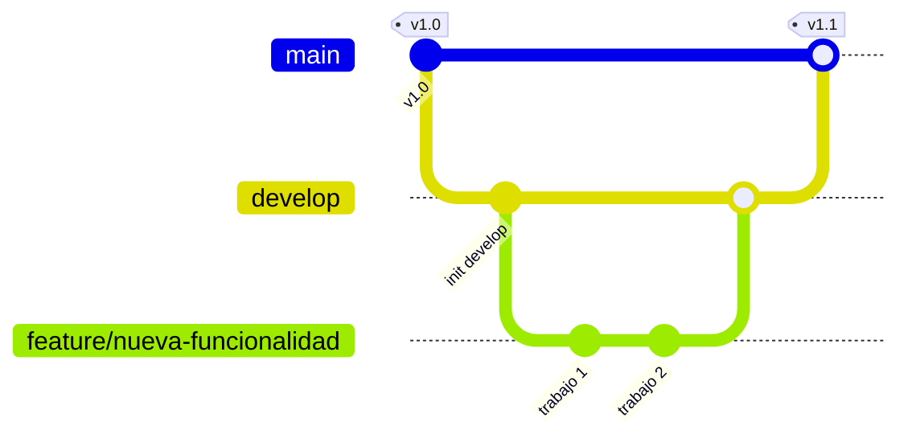
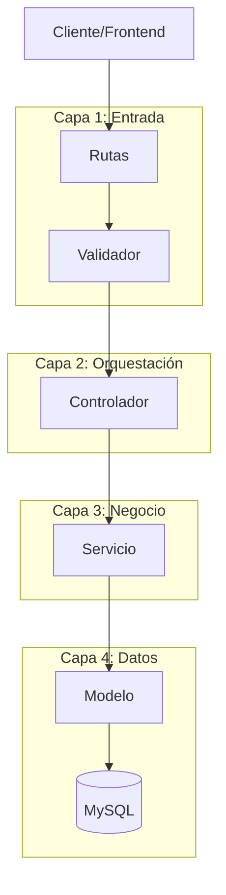

# Guía de Contribución

¡Hola! 👋 Gracias por sumarte al desarrollo del **Backend API REST** de la Clínica Médica. Este proyecto es una pieza central de nuestro aprendizaje en **Programación III (TUDW - UNER)**. Para que el equipo funcione como un reloj, seguimos este flujo. ¡Dale, metamosle pilas! 🚀

---

## 🔄 1. Flujo de Trabajo (Workflow)

Para mantener el orden, utilizamos una variante de **Git Flow**. Nadie toca `main` y nadie pushea directo a `develop`.



### Ramas (Branching)

- `main`: Código estable y productivo. **No se pushea directo acá.**
- `develop`: Es la rama de integración. Aquí se juntan todas las funcionalidades terminadas.
- `feature/nombre-funcionalidad`: Para nuevas características.
- `fix/descripcion-error`: Para corrección de bugs.
- `refactor/descripcion`: Para mejoras de código sin cambiar funcionalidad.

### El paso a paso:

1.  **Sincronizá**: Parado en `develop`, hacé `git pull origin develop`.
2.  **Ramificá**: Creá tu rama de trabajo: `git checkout -b feature/nombre-funcionalidad`.
3.  **Laburá**: Hacé tus cambios y commits (Husky va a validar el estilo).
4.  **Subí**: Subí tu rama: `git push origin feature/nombre-funcionalidad`.
5.  **PR**: Abrí un **Pull Request** hacia la rama `develop`.
6.  **Review**: Un compañero debe revisar tu código. Si está OK, se mezcla.

---

## 🏗️ 2. El Flujo de Código (Arquitectura)

Seguimos una **Arquitectura de Capas** modular. El flujo de datos siempre es unidireccional: **Ruta -> Validador -> Controlador -> Servicio -> Modelo**.



### ¿Cómo programo un nuevo módulo?

Programá siempre **de ADENTRO hacia AFUERA**:

1.  **Modelo (`*.model.js`)**: Consultas SQL puras con `mysql2`.
2.  **Servicio (`*.service.js`)**: Lógica de negocio y reglas de la clínica.
3.  **Validador (`*.validator.js`)**: Esquemas de `express-validator`.
4.  **Controlador (`*.controller.js`)**: Recibe `req` y envía `res` usando helpers.
5.  **Rutas (`*.routes.js`)**: Conecta el endpoint con el flujo anterior.

---

## 🚀 3. Reglas de Oro y Estándares

### Calidad de Código

- **Respuestas**: Usar siempre `successResponse` o `errorResponse` de `src/helpers/response.helper.js`.
- **Errores**: Usar la clase `AppError` para errores operativos.
- **Borrado**: Usamos **Borrado Lógico** (`activo = 0`). Nada de `DELETE` físico.
- **Naming**: Archivos en `snake_case`, variables en `camelCase`.

### Antes de Commitear (Husky)

Al hacer `git commit`, se ejecutarán automáticamente **ESLint** y **Prettier**. Si hay errores, el commit rebotará. ¡Mantené el código limpio!

### Commits Convencionales

Formato: `tipo(alcance): descripción breve`

- `feat`: Nueva funcionalidad.
- `fix`: Corrección de error.
- `docs`: Documentación.
- `test`: Agregar/arreglar tests.

---

## 🛠️ 4. Configuración del Entorno

### Pasos Rápidos

```bash
git clone https://github.com/sergioortegadev/uner-prog3-grupo-ai.git
cd uner-prog3-grupo-ai/tp-final-integrador
npm install           # Instala dependencias y Husky
cp .env.example .env  # Configurá tu DB
npm run infra:up      # Levanta DB en Docker (Opcional)
npm run dev           # ¡A programar!
```

---

## 💬 ¿Necesitás Ayuda?

- Consultá la carpeta `docs/`.
- Tirá la duda en el grupo de WhatsApp.
- ¡No te quedes con la duda, preguntale a tus compañeros!
