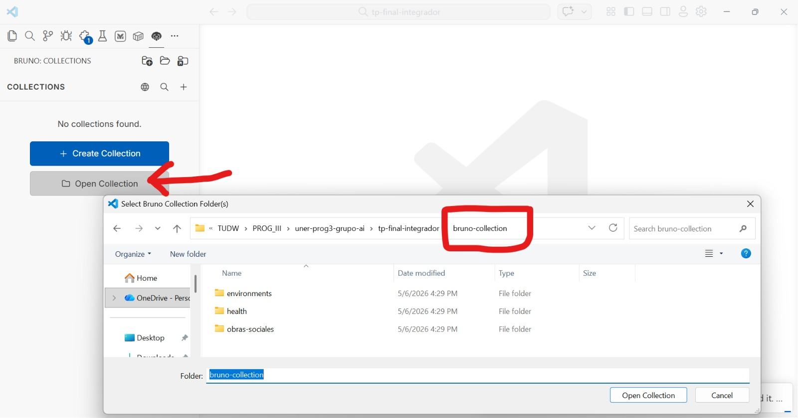
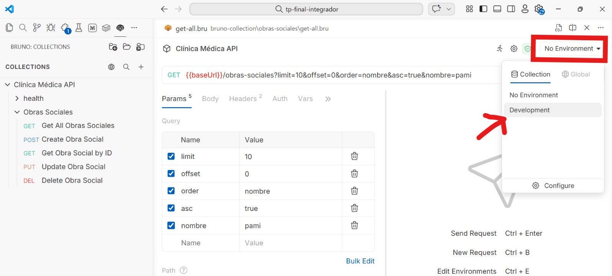

# Referencia de Endpoints (API v1)

Este documento detalla los endpoints disponibles en la API para facilitar las pruebas y la revisión por parte de la cátedra. Swagger será implementado en una etapa posterior.
## 🧬 Especialidades (`/especialidades`)

| Método | Endpoint | Descripción | Acceso |
| :--- | :--- | :--- | :--- |
| `GET` | `/api/v1/especialidades` | Listar todas (soporta filtros) | Paciente/Admin |
| `POST` | `/api/v1/especialidades` | Registrar nueva especialidad | Admin |
| `GET` | `/api/v1/especialidades/:id` | Obtener detalle por ID | Paciente/Admin |
| `PUT` | `/api/v1/especialidades/:id` | Actualizar datos por ID | Admin |
| `DELETE` | `/api/v1/especialidades/:id` | Baja lógica (Soft Delete) | Admin |

---

## 🏥 Obras Sociales (`/obras-sociales`)

| Método | Endpoint | Descripción |
| :--- | :--- | :--- |
| `GET` | `/api/v1/obras-sociales` | Listar todas (soporta filtros y orden) |
| `POST` | `/api/v1/obras-sociales` | Registrar nueva obra social |
| `GET` | `/api/v1/obras-sociales/:id` | Obtener detalle por ID |
| `PUT` | `/api/v1/obras-sociales/:id` | Actualizar datos por ID |
| `DELETE` | `/api/v1/obras-sociales/:id` | Baja lógica (Soft Delete) |

### Parámetros de consulta (GET)
- `order`: Campo por el cual ordenar (`id`, `nombre`, `porcentajeDescuento` o `activo`).
- `asc`: Dirección del orden (`true` o `false`).
- `limit`: Cantidad de resultados.
- Filtros directos: `activo=1`, `nombre=Jerárquicos`.

---

## ⚙️ Sistema (`/health`)

| Método | Endpoint | Descripción | Acceso |
| :--- | :--- | :--- | :--- |
| `GET` | `/api/v1/health` | Estado de la API y conexión a DB | Público |

---

## 🔐 Autenticación (`/auth`)

| Método | Endpoint | Descripción | Acceso |
| :--- | :--- | :--- | :--- |
| `POST` | `/api/v1/auth/login` | Iniciar sesión y obtener JWT | Público |

---

## 🚀 Próximamente

Los siguientes módulos están en desarrollo:
- **Médicos**: Gestión de profesionales y especialidades.
- **Pacientes**: Gestión de perfiles y obras sociales.
- **Turnos**: Sistema de reserva y agenda médica.

---

## 🛠️ Colección de Pruebas

Para una prueba rápida, recomendamos usar la colección de **Bruno** ubicada en:
`tp-final-integrador/bruno-collection/`

### Pasos para configurar:

1. **Abrir la colección**:
   - Abrí la aplicación Bruno.
   - Hacé clic en **"Open Collection"** en la pantalla de inicio.
   - Seleccioná la carpeta `bruno-collection` que se encuentra en la raíz de este proyecto.

   

2. **Seleccionar el Entorno (Environment)**:
   - Una vez abierta, hacé clic en el selector de entornos en la esquina superior derecha (donde dice "No Environment").
   - Seleccioná **"Development"**. Esto cargará las variables necesarias (como la URL base de la API).

   
